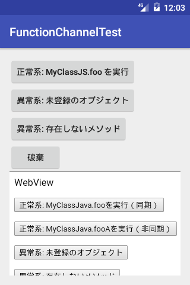

# <p align="center"></p>
FunctionChannel の Android用の実装を提供します。

## Example 
本リポジトリの [app](app) モジュールが, WebView(HTML) と ネイティブコード(Java) 間の FunctionChannel で相互にRPCをする簡単なサンプルになっています。



- Java: [MainActivity.java](app/src/main/java/jp/co/dwango/cbb/fc/test/MainActivity.java), [MyClassJava.java](app/src/main/java/jp/co/dwango/cbb/fc/test/MyClassJava.java)
- HTML: [index.html](app/src/main/assets/html/index.html), [script.js](app/src/main/assets/html/script.js), [data-channel.js](app/src/main/assets/html/data-channel.js), [function-channel.js](app/src/main/assets/html/function-channel.js)

## Setup 
### gradle
```
dependencies {
	compile 'jp.co.dwango.cbb:function-channel:2.0.5'
}
```

## Usage
#### step 1: FunctionChannelを準備
使用するDataChannelインスタンスを指定してFunctionChannelを生成します。

```java
	FunctionChannel functionChannel = new FunctionChannel(dataChannel);
```

#### step 2: リモート側から実行できるメソッドを定義したクラスを準備
リモート側からの実行を許可するメソッドには, `@CrossBorderMethod` アノテーションを付与する必要があります。

例: [MyClassJava.java](app/src/main/java/jp/co/dwango/cbb/fc/test/MyClassJava.java)

```java
class MyClassJava {
	// 引数に指定されたテキストを結合して返すメソッド（同期）
	@CrossBorderMethod
	public String foo(String a1, String a2, String a3) {
		return a1 + a2 + a3;
	}

	// 引数に指定されたテキストを結合して返すメソッド（非同期）
	// ※非同期であることを分かり易くするため, 3秒後に応答を返す
	@CrossBorderMethod
	public AsyncResult<String> fooA(final String a1, final String a2, final String a3) {
		// AsyncResult<Type> を new して return
		// runでこのメソッドの処理を実装する
		return new AsyncResult<String>() {
			@Override
			public void run(AsyncCallback<String> callback) {
				// 3秒間sleep
				try {
					Thread.sleep(3000);
				} catch (InterruptedException e) {
					e.printStackTrace();
				}
				// callback#onResult で 戻り値を返す
				callback.onResult(a1 + a2 + a3);
			}
		};
	}
}
```

非同期メソッドは, 次のように実装してください。

1. 戻り値の型を `AsyncResult<Type>` にする
2. `AsyncResult<Type>` の実体をメソッド内でインスタンス化したものを `return` する
3. 処理が完了した時, `callback.onResult` を呼び出して戻り値を返す

他ホストと通信をする処理など, 実行に時間を要する処理の場合, 非同期で実装することが望ましいです。

> FunctionChannelはリクエストされたRPC要求を逐次実行します。
>
> 例えば, 実行に3秒掛かるメソッドをほぼ同時に3回連続して実行した時, そのメソッドが同期か非同期のどちらで実装したかによって, 実行に要する時間に次のような違いが生じます。
> - 同期の場合: 実行に掛かる所要時間 =  __9秒__
> - 非同期の場合: 実行に掛かる所要時間 = __3秒__

#### step 3: 準備したクラスの実体をbind
step 2 で準備したクラスの実体を `FunctionChannel#bind` で登録することで, リモート側からメソッドを呼び出すことができる状態になります。

```java
	functionChannel.bind("MyClassJava", new MyClassJava());
```

> `FunctionChannel#unbind` で `bind` 状態を解除することができます。

#### step 4: リモート側のメソッドを実行
`FunctionChannel#invoke` でリモート側に `bind` されているオブジェクトのメソッドを実行することができます。

```java
	JSONArray args = new JSONArray().put("One").put(2).put("3");
	functionChannel.invoke("MyClassJS", "foo", args, new FunctionChannelCallback() {
		@Override
		public void onResult(boolean isError, Object result) {
			String text = "isError: " + isError + "\nresult: " + result;
			Toast.makeText(MainActivity.this, text, Toast.LENGTH_SHORT).show();
		}
	});
```

> `invoke` に失敗した場合, `isError` が `true` になり, `result` に `FunctionChannelError (enum)` が格納されます。

戻り値を必要としない場合は, 第4引数の `FunctionChannelCallback` の指定を省略してください。

```java
	JSONArray args = new JSONArray().put("One").put(2).put("3");
	functionChannel.invoke("MyClassJS", "foo", args);
```

> 戻り値無しで実行した場合, FunctionChannel は PUSH で要求を送信するため, 実行が正常にできたのかを確認することができません。

#### step 5: 破棄
`FunctionChannel#destroy` で破棄できます。

```java
	functionChannel.destroy();
```

> FunctionChannelをdestroyしても下位層（DataChannel, DataBus）のdestroyは行われません。

## License
- Source code, Documents: [MIT](LICENSE)
- Image files: [CC BY 2.1 JP](https://creativecommons.org/licenses/by/2.1/jp/)
